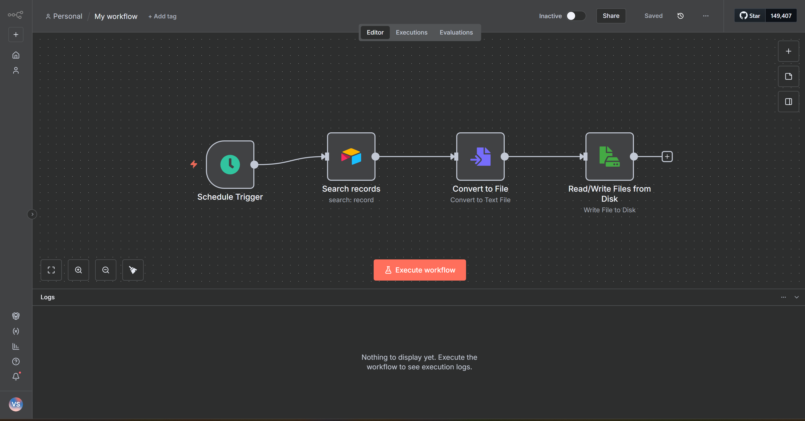
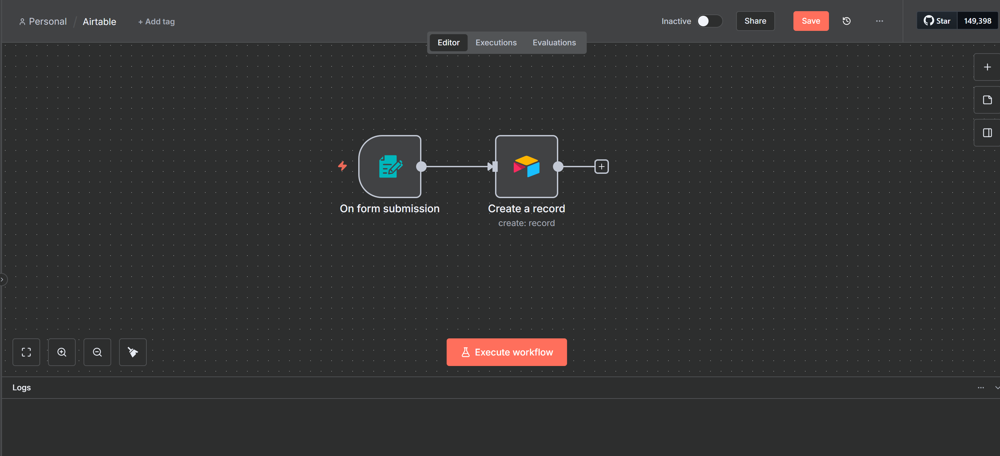

# n8n Workflow: Airtable Record Automation

## Description
This workflow demonstrates how to automate Airtable record creation using n8n.  
It is designed to take input data (e.g., Name, Room preference) and automatically create records in an Airtable base.

**Purpose:**  
- Learn n8n automation with Airtable  
- Build a real-world example of data integration  
- Showcase workflow logic and API connections  

---

## Workflow Details

**Trigger:** Manual or scheduled workflow in n8n

**Nodes Used:**
- **Start Node:** Workflow entry point
- **Set Node:** Prepare input data
- **Airtable Node (Create Record):** Sends data to Airtable
  - Base: Test Airtable
  - Table: Table 1
  - Columns mapped: Name, Room

---
## Notes
- Make sure your Airtable token has scopes: `read`, `write`, `schema`  
- Ensure your base and table are accessible from the token  
- Start with test data to avoid overwriting real records  
- Screenshots show the workflow layout and configuration

# n8n Workflow: Airtable Search Record

## Description
This workflow demonstrates how to search records in Airtable using n8n.

## Purpose
To automatically retrieve records based on input criteria, e.g., search by Name or Room.

## Steps
1. Input data (Name or ID)
2. n8n searches the Airtable base
3. Returns matching records

## Screenshots

## Author
**Uday Dhanush**  
Portfolio: [https://github.com/udaydhanush0207]
