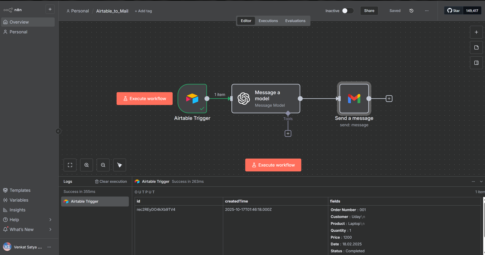

# n8n Workflow: Airtable Record Automation

## Description
This workflow demonstrates how to automate Airtable record creation using n8n.  
It is designed to take input data (e.g., Name, Room preference) and automatically create records in an Airtable base.

**Purpose:**  
- Learn n8n automation with Airtable  
- Build a real-world example of data integration  
- Showcase workflow logic and API connections  

---

## Workflow Details

**Trigger:** Manual or scheduled workflow in n8n

**Nodes Used:**
- **Start Node:** Workflow entry point
- **Set Node:** Prepare input data
- **Airtable Node (Create Record):** Sends data to Airtable
  - Base: Test Airtable
  - Table: Table 1
  - Columns mapped: Name, Room

---
## Notes
- Make sure your Airtable token has scopes: `read`, `write`, `schema`  
- Ensure your base and table are accessible from the token  
- Start with test data to avoid overwriting real records  
- Screenshots show the workflow layout and configuration

# n8n Workflow: Airtable Search Record

## Description
This workflow demonstrates how to search records in Airtable using n8n.

## Purpose
To automatically retrieve records based on input criteria, e.g., search by Name or Room.

## Steps
1. Input data (Name or ID)
2. n8n searches the Airtable base
3. Returns matching records

# Email Automation for Customer Bookings

## Overview
This workflow demonstrates how to automate email notifications for new customer orders using **n8n**, **Airtable**, **OpenAI (ChatGPT/GPT-4)**, and **Gmail**.  
Whenever a new order is added to Airtable, the workflow triggers, generates an AI-powered summary email, and sends it automatically.

---

## Workflow Details

**Trigger:** Airtable → monitors new or updated records every minute  
**Processing:** OpenAI GPT-4 → generates a clear email summary of the order  
**Action:** Gmail → sends the email to the designated recipient

---

## Steps

1. **Airtable Trigger**
   - Base: `Customer Orders`
   - Table: `Table 2`
   - Trigger Field: `Order Number`
   - Polling interval: 1 minute
   - Fetch Test Event to confirm connection

2. **OpenAI Node**
   - Model: GPT-4
   - Operation: Message Model
   - Prompt: Generates email with **Email, Subject, Content**
   - Variables mapped from Airtable: Order Number, Customer, Product, Quantity, Price, Date, Status

3. **Gmail Node**
   - Operation: Send a Message
   - OAuth credentials via Google Cloud Console
   - Maps OpenAI output fields to **Subject** and **Body**
   - Sends email to specified recipient
   - Plain text format for clarity

---

## Testing
- Add a new row in Airtable (e.g., order number `006`, customer `Maria`, product `Test Printer`, price `300`, status `Completed`)  
- Workflow triggers automatically within a minute  
- Email is generated and sent to recipient  
- Execution logs can be monitored in n8n

---
# n8n Workflow: Sentiment Analysis with OpenAI & Google Sheets

## Overview
This n8n workflow performs **sentiment analysis** on customer feedback using **OpenAI (GPT-4)** and logs the results into **Google Sheets**.  
It helps automate feedback tracking and categorize responses as *Positive*, *Negative*, or *Neutral*.

---

## ⚙️ Workflow Summary

| Step | Node | Function |
|------|------|-----------|
| 1️⃣ | **Google Sheets (Read)** | Fetch feedback text from a sheet |
| 2️⃣ | **OpenAI (GPT-4)** | Analyze sentiment and reasoning |
| 3️⃣ | **Google Sheets (Update)** | Write sentiment & reason back |

---

## Setup Requirements

1. **Google Cloud**
   - Enable **Sheets API** & **Drive API**  
   - Create **OAuth2 credentials** and connect in n8n  
   - Add redirect URI shown in n8n credentials

2. **OpenAI**
   - Get API key from [OpenAI Dashboard](https://platform.openai.com/)  
   - Add key in n8n credentials

---

# n8n Workflow: Sentiment Analysis with OpenAI & Google Sheets

## Overview
This n8n workflow performs **sentiment analysis** on customer feedback using **OpenAI (GPT-4)** and logs the results into **Google Sheets**.  
It helps automate feedback tracking and categorize responses as *Positive*, *Negative*, or *Neutral*.

---

## ⚙️ Workflow Summary

| Step | Node | Function |
|------|------|-----------|
| 1️⃣ | **Google Sheets (Read)** | Fetch feedback text from a sheet |
| 2️⃣ | **OpenAI (GPT-4)** | Analyze sentiment and reasoning |
| 3️⃣ | **Google Sheets (Update)** | Write sentiment & reason back |

---

## Setup Requirements

1. **Google Cloud**
   - Enable **Sheets API** & **Drive API**  
   - Create **OAuth2 credentials** and connect in n8n  
   - Add redirect URI shown in n8n credentials

2. **OpenAI**
   - Get API key from [OpenAI Dashboard](https://platform.openai.com/)  
   - Add key in n8n credentials

---

## Author
**Uday Dhanush**  
Portfolio: [https://github.com/udaydhanush0207]
